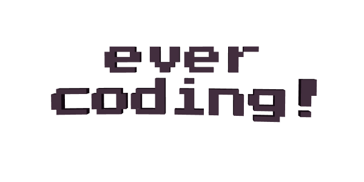

<!-- titulo -->
# 

<!-- banner -->

    

<!-- Sobre mim -->
## About me 

 
    Sou estudante de Análise e Desenvolvimento de Sistemas pela FIAP, entusiasta de tecnologia e focado em aprimorar minhas habilidades como desenvolvedor.

*Não deixe de conferir também o meu* <a href="https://github.com/guicarbar/Portfolio_Guilherme" title="Repositorio do Portfólio" target="_blank">Portfólio</a>

## <h1 width="100%"> Analytics </h1> :paperclip:

## Contact :memo:

    

